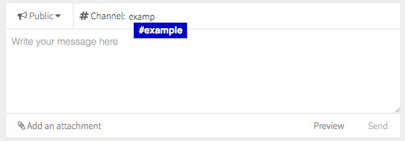

# Post Composer

Composer component for public and private text posts



```jsx
import Composer from 'patchkit-post-composer'

<Composer 
  thread={thread}
  recps={[userid1,userid2]}
  channel="initial-channel-value"
  channels={app.channels}
  suggestOptions={app.suggestOptions}
  placeholder="Write your message here"

  onSend={onSend}
  onCancel={onCancel}

  isPublic
  cancelBtn />
```

Options:

  - `channels`: Channel suggestions (array of strings).
  - `suggestOptions`: Suggest-box suggestions (see [suggest-box](https://www.npmjs.com/package/suggest-box)).
  - `thread`: Thread/message object, if this is a reply.
  - `channel`: Default channel value.
  - `recps`: Default recipients value (array of IDs).
  - `placeholder`: Placeholder string when there's no value.
  - `onSend`: Function called on publish.
  - `onCancel`: Function called on cancel.
  - `isPublic`: Default to public or private?
  - `verticalFilled`: Have the composer fill the vertical space?
  - `cancelBtn`: Should there be a cancel button?

## Styles

Use the .less file:

```less
@import "node_modules/patchkit-post-composer/styles.less"
```